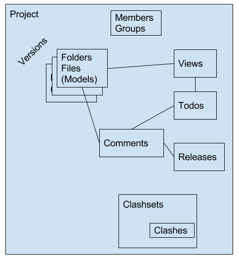
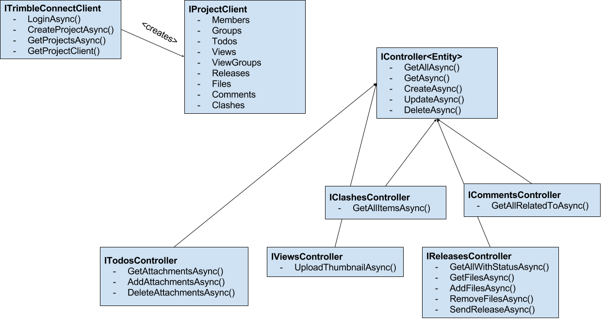

# Trimble.Connect.Client .NET SDK Developer Guide

### Content

1. [Overview](#overview)
2. [Authentication](#authentication)
	+ [Example: Sign-in TC Platform Services](#sign-in-example)
	+ [Example: Use retry handler to refresh expired access token automatically](#refresh-token-example)
3. [TC Data Model](#data-model)
4. [Accessing TC Platform Services](#accessing-tc)
5. [Extensibility mechanisms](#extensibility-mechanisms)
6. [Search API](#search)
7. [Code snippets](#tc_snippets)
	+  [Example: Access TC Services](#example-access-tc)
	+  [Example: How to enumerate paged results](#example-paging)
	+  [Example: Using delegating handlers to implement network activity indicator](#example-delegating-handlers)

### Acronyms

TID - Trimble Identity, identity provider

TC - Trimble Connect

## <a name="overview">Overview</a>

The Trimble.Connect.Client component represents a set of TC Platform Services REST API wrappers. All TC APIs are provided for use by connected applications as _wrappers_. Wrappers provide full create, read, update, delete (CRUD) functionality against TC entities. Wrappers work on the same abstraction level as the web API and mostly map RESTful API requests one-to-one into .NET HTTP requests.

This layer's responsibilities include:

* Consistent error handling and convenient ways to deal with varying network performance (like async mechanisms and progress reporting).
* Providing an easy to use abstraction for your targeted platforms and programming language.
* Supporting middleware message handlers
* Leveraging strongly typed entity recognition for data modeling
* Graceful error handling
* Adherence to HTTP conventions and standards

The TC REST API specification can be found here: 

* Staging: [https://app.stage.connect.trimble.com/tc/static/apidoc.html](https://app.stage.connect.trimble.com/tc/static/apidoc.html) 

* Production: [https://app.connect.trimble.com/tc/static/apidoc.html](https://app.connect.trimble.com/tc/static/apidoc.html) 

The video tutorial: [SDK Authentication using the Identity library](https://youtu.be/XaQXK4Y3TpE?t=2m20s).

## <a name="overview">Authentication</a>

## Deprecated Workflow
TC uses token based authentication. The token is acquired during the TID OAuth2 (OpenID Connect) authentication (see [Trimble.Identity Developer Guide](Trimble.Identity%20Developer%20Guide.md)).

It is important to understand that the ID token is generally a one use token with short life span. This means that when the token is expired and a new TID token needs to be acquired. App will have to request a new id token from TID.  This can be done by `AuthenticationContext.AcquireTokenByRefreshTokenAsync` or by using `RefreshOptions.IdToken` option in other `AuthenticationContext.AcquireTokenAsync` methods. Please refer to the [Trimble.Identity Developer Guide](Trimble.Identity%20Developer%20Guide.md).

The application should initialize the Trimble connect user with the acquired access token from TID.

## Updated workflow

The clients can use Trimble.Identity.OAuth.AuthCode for interactive workflow authentication or Trimble.Identity.OAuth.Password for headless applications (like from test code).
The clients can also provide any custom implementation of ICredentialsProvider.

### <a name="example-sign-in">Example: Authenticating with TC API </a>

Authenticate with TID and initialize the Trimble connect user. 

     var clientCreds = new ClientCredential(ClientId, ClientKey)
            {
                RedirectUri = new Uri(RedirectUrl),
            };
    var authCtx = new AuthenticationContext(clientCreds)
            {
                AuthorityUri = new Uri(AuthorityUrl),
            };
    var provider = new AuthCodeCredentialsProvider(authCtx)
            {
                AuthenticationRequest = new InteractiveAuthenticationRequest();
            };
    var config = new TrimbleConnectClientConfig { ServiceURI = TCServiceUri};
    config.RetryConfig = new RetryConfig { MaxErrorRetry = 1 };
    using (var client = new TrimbleConnectClient(config, provider))
    {    
        ...
    }

## <a name="data-model">TC Data Model</a>

## <a name="accessing-tc">Accessing the TC API</a>

Below is a class diagram that describes the API programming models used in the SDK component to access the TC service.

## <a name="extensibility-mechanisms">Extensibility mechanisms</a>

The SDK client component is designed to be backward and forward compatible. This means that applications released with older versions of the SDK should be still functional when new TC Service APIs release. Also if by some reason app developers don't want to migrate to newer versions of the SDK but need access to new TC Service APIs this can be done as well by using extension mechanisms.

The following mechanisms are used to achieve this flexibility:

1. Each entity has a `Properties` attribute implemented as a generic dictionary. This is a collection of "unknown" or "open" properties. E.g. if a new property is added to the entity after SDK has been released app can access such property from this dictionary.
2. We prefer string literals to enums. This makes it possible to deserialize new values even if they were not known at the time of SDK compilation.
3. All updates to entities are done using PATCH requests instead of PUT.
4. There is a generic mechanism to pass additional query parameters to the `GetAllAsync` and `SearchAsync` methods
5. There is a generic mechanism to invoke any TC API method in a dynamic way: `InvokeApiAsync`.
6. Application developer can provide custom `HttpMessageHandler` and `DelegatingHandlers` when creating `TrimbleConnectClient`. This is very powerfull mechanism to implement custom processing in the http pipeline. One example can be found [below](#example-delegating-handlers).

## <a name="search">Search API</a>

The search API allows you to search for items across the projects.

    Task<IQueryResult<SearchResult>> SearchAsync(
            SearchQuery query,
            IDictionary<string, string> parameters = null,
            long? pageSize = null,
            CancellationToken cancellationToken = default(CancellationToken));

There is a convinient search query builder. 
E.g. in following example we search for ToDos created last 7 days that has a word `test` across all projects.

    var now = DateTimeOffset.UtcNow;
    var query = Search.For<Todo>("test").Between(now.AddDays(-7), now);
    await client.SearchAsync(query, 100).ReceiveAll((page) => {...});

E.g. in following example shows how to search for any entity with word `test` in specific project.

    var query = Search.For("test").In(projectIdentifier);
    await client.SearchAsync(query, 100).ReceiveAll((page) => {...});

## <a name="tc_snippets">Code Snippets</a>
Below are some examples on using the Trimble Connect Client component.
Full sample applications can be found on [github](https://github.com/Trimble-Connect/samples)

### <a name="example-access-tc">Example: Access TC API endpoints</a>

    // list all projects
    var projects = await client.GetProjectsAsync();
    var project = projects.First();
    
    // get project specific wrapper
    var projectClient = await client.GetProjectClientAsync(project);
    
    // working with todos
    var todos = await projectClient.Todos.GetAllAsync();
    
    // working with files
    var files = (await projectClient.Files.GetFolderItemsAsync(project.RootFolderIdentifier)).ToArray();

    var file = files.FirstOrDefault(f => f.Type == EntityType.File);
    var stream = await projectClient.Files.DownloadAsync(file.Identifier);
    var destPath = Path.GetTempFileName();

    using (var destination = File.Create(destPath))
    {
        await stream.CopyToAsync(destination);
    }

### <a name="example-paging">Example: How to enumerate paged results</a>

Most methods that return a list of entities (like `GetAllAsync` and `SearchAsync` methods) accept a `pageSize`  paramter and return an instance of `IQueryResult<T>`. Entities should be read from the `IQueryResult<T>` page by page. Note that `IQueryResult<T>` can be enymerated only once.

    var page = await client.SearchAsync(....);
    do
    {
		foreach(var entity in page)
		{
			// ... process each entity
		}

        if (page.HasMore)
        {
            page = await page.GetNextPageAsync(cancellationToken);
        }
        else
        {
            break;
        }
    }
	while (true);

There is a helper extension method `ReceiveAll` that encapsulates the enumeration logic for all pages and accepts a callback to be called for each page.

    await client.ClashSets.GetItemsAsync(clashset.Identifier, 100).ReceiveAll(
		(items) => { Console.WriteLine("Received {0}", items.Count()); });

### <a name="example-delegating-handlers">Example: Using delegating handlers to implement network activity indicator</a>

The code snippet below demonstrates how to use http delegating handlers to implement network activity indicator in the app.

    public class BusyHandler : DelegatingHandler
    {
        private int _callCount;
        private readonly Action<bool> _busyIndicator;
        
        public BusyHandler(Action<bool> busyIndicator)
        {
            _busyIndicator = busyIndicator;
        }
        
        protected override async Task<HttpResponseMessage> SendAsync(
          HttpRequestMessage request, CancellationToken cancellationToken)
        {
             // update the count by one in a single atomic operation. 
             // If we get a 1 back, we know we just went 'busy'
             var outgoingCount = Interlocked.Increment(ref _callCount);
             if (outgoingCount == 1)
             {
                 _busyIndicator(true);
             }
             
             var response = await base.SendAsync(request, cancellationToken);
             
             // decrement the count by one in a single atomic operation.
             // If we get a 0 back, we know we just went 'idle'
             var incomingCount = Interlocked.Decrement(ref _callCount);
             if (incomingCount == 0)
             {
                 _busyIndicator(false);
             }
             
             return response;
        }
    }

