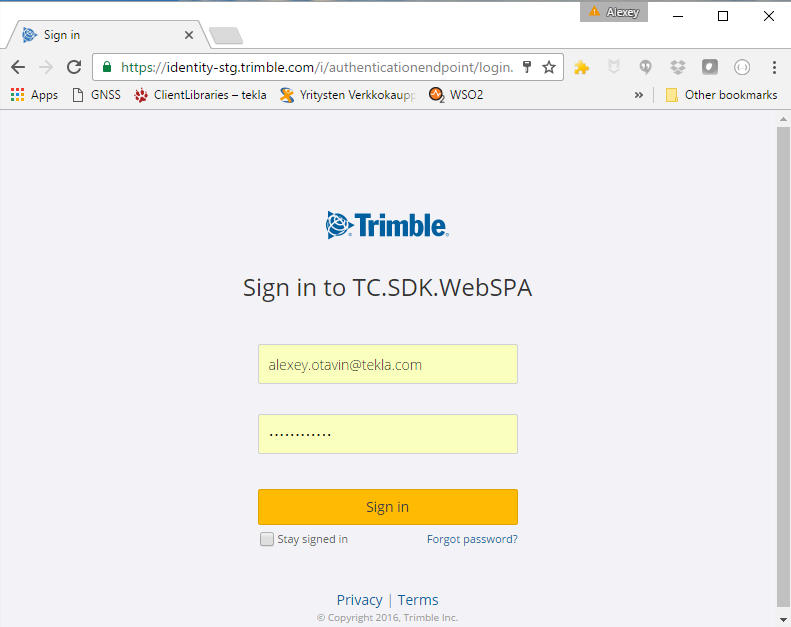

# Trimble.Identity.AspNetCore Developer Guide

### Content

1. [Overview](#overview)
2. [Create a New ASP.NET Core Project](#create)
3. [Enable SSL](#ssl)
4. [Use SecretManager to store tokens assigned by login providers](#SecretManager)
5. [Setup Trimble Identity login provider](#provider)
	1. [Creating the app in TPaaS Developer Console](#tdc)
	2. [Storing Trimble app credentials](#appcreds)
	3. [Enable Trimble middleware](#middleware)
	4. [Sign in with Trimble](#signin)
6. [Using Trimble Identity claims](#claims)

### Acronyms

TID - Trimble Identity

## <a name="overview">Overview</a>

**Trimble.Identity.AspNetCore** is a security middleware that you can use in your ASP.NET Core 1.0 application to support Trimble.Identity authentication.

This tutorial demonstrates how to build an ASP.NET Core app that enables users to log in using Trimble Identity external authentication providers. It is adapted from the [Enabling authentication using Facebook, Google and other external providers](https://docs.microsoft.com/en-us/aspnet/core/security/authentication/sociallogins) blog post by Rick Anderson, Pranav Rastogi and Valeriy Novytskyy. 

### <a name="create">Create a New ASP.NET Core Project</a>

> Note: This tutorial requires the latest update (Update 3) for Visual Studio 2015 and ASP.NET Core.

In Visual Studio, create a new project (from the Start Page, or via File > New > Project):

Tap Web Application and verify Authentication is set to Individual User Accounts:

### <a name="ssl">Enable SSL</a>

Trimble Identity authentication provider reject requests coming from origins that don't use the https protocol.

We encourage you to follow this trend and enable SSL for your entire site.

- In Solution Explorer, right-click the project and select Properties.
- On the left pane, tap Debug.
- Check Enable SSL.
- Copy the SSL URL and paste it into the App URL:

Modify the services.AddMvc(); code in Startup.cs under ConfigureServices to reject all requests that are not coming over https:

	services.AddMvc(options =>
	{
	    options.SslPort = 44320;
	    options.Filters.Add(new RequireHttpsAttribute ());
	});

Test the app to ensure that static files are still being served and publicly exposed routes are accessible.

- There shouldn't be any warnings logged to the browser console in Developer Tools.
- Attempting to navigate to the previous URL that used the http protocol should now result in connection rejected errors from the browser or a blank page.

### <a name="SecretManager">Use SecretManager to store tokens assigned by login providers</a>

The template used to create the sample project in this tutorial has code in Startup.cs which reads the configuration values from a secret store:

	public Startup(IHostingEnvironment env)
	{
	    var builder = new ConfigurationBuilder()
	        .SetBasePath(env.ContentRootPath)
	        .AddJsonFile("appsettings.json", optional: true, reloadOnChange: true)
	        .AddJsonFile($"appsettings.{env.EnvironmentName}.json", optional: true);
	
	    if (env.IsDevelopment())
	    {
	        // For more details on using the user secret store see http://go.microsoft.com/fwlink/?LinkID=532709
	        builder.AddUserSecrets();
	    }
	
	    builder.AddEnvironmentVariables();
	    Configuration = builder.Build();
	}

As a best practice, it is not recommended to store the secrets in a configuration file in the application since they can be checked into source control which may be publicly accessible.+

The SecretManager tool stores sensitive application settings in the user profile folder on the local machine. These settings are then seamlessly merged with settings from all other sources during application startup.

Install the [Secret Manager tool](https://docs.microsoft.com/en-us/aspnet/core/security/app-secrets) so that you can use it to store tokens assigned by each login provider below.

### <a name="provider">Setup Trimble Identity login provider</a>

#### <a name="tdc">Creating the app in TPaaS Developer Console</a>

The current way for getting the Connect API credentials for Trimble applications is to register the application yourself using the TPaaS developer console, here are the addresses:

- Staging <https://tdc-stg.trimblepaas.com>
- Production: <https://tdc.trimblepaas.com>

Enter your current site URL with `signin-trimble` appended into the Authorized redirect URIs field. For example, `https://localhost:44320/signin-trimble`.

#### <a name="appcreds">Storing Trimble app credentials</a>

Link sensitive settings like Trimble ClientID and ClientSecret to your application configuration by using the [Secret Manager tool](https://docs.microsoft.com/en-us/aspnet/core/security/app-secrets) instead of storing them in your configuration file directly.

Execute the following commands in your project working directory to store the Trimble secrets:

	dotnet user-secrets set Authentication:Trimble:ClientID <client_id>
	dotnet user-secrets set Authentication:Trimble:ClientSecret <client-secret>

#### <a name="middleware">Enable Trimble middleware</a>

Use NuGet to install the [Trimble.Identity.AspNetCore](https://www.nuget.org/packages/Trimble.Identity.AspNetCore) package if it hasn't already been installed. Alternatively, execute the following commands in your project directory:

	dotnet install Trimble.Identity.AspNetCore

Add the Trimble middleware in the `Configure` method in `Startup.cs`:

	app.UseTrimbleAuthentication(new TrimbleAuthenticationOptions
	{
        Environment = TrimbleEnvironment.Staging,
	    ClientId = Configuration["Authentication:Trimble:ClientId"],
	    ClientSecret = Configuration["Authentication:Trimble:ClientSecret"],
		SaveTokens = true,
	});

#### <a name="signin">Sign in with Trimble</a>

Run your application and click Log in. An option to sign in with Trimble appears:

When you click on Trimble, you are redirected to Trimble Identity for authentication:

After entering your Trimble credentials, then you are redirected back to the web site where you can set your email.

You are now logged in using your Trimble credentials.

### <a name="claims">Using Trimble Identity claims</a>

You can access the user claims and tokens issued by Trimble Identity provider in the `ExternalLoginCallback`.
Claims are in the `info.Principal.Claims` collection.
Tokens (access, id, refresh) are in the `info.AuthenticationTokens` collection (note that the `TrimbleAuthenticationOptions.SaveTokens` must be set to `true` on startup).

        //
        // POST: /Account/ExternalLogin
        [HttpPost]
        [AllowAnonymous]
        [ValidateAntiForgeryToken]
        public IActionResult ExternalLogin(string provider, string returnUrl = null)
        {
            // Request a redirect to the external login provider.
            var redirectUrl = Url.Action("ExternalLoginCallback", "Account", new { ReturnUrl = returnUrl });
            var properties = _signInManager.ConfigureExternalAuthenticationProperties(provider, redirectUrl);
            return Challenge(properties, provider);
        }

        //
        // GET: /Account/ExternalLoginCallback
        [HttpGet]
        [AllowAnonymous]
        public async Task<IActionResult> ExternalLoginCallback(string returnUrl = null, string remoteError = null)
        {
            if (remoteError != null)
            {
                ModelState.AddModelError(string.Empty, $"Error from external provider: {remoteError}");
                return View(nameof(Login));
            }
            var info = await _signInManager.GetExternalLoginInfoAsync();
            if (info == null)
            {
                return RedirectToAction(nameof(Login));
            }

			// use info.Principal.Claims and info.AuthenticationTokens to find out about the user
			...
         }
