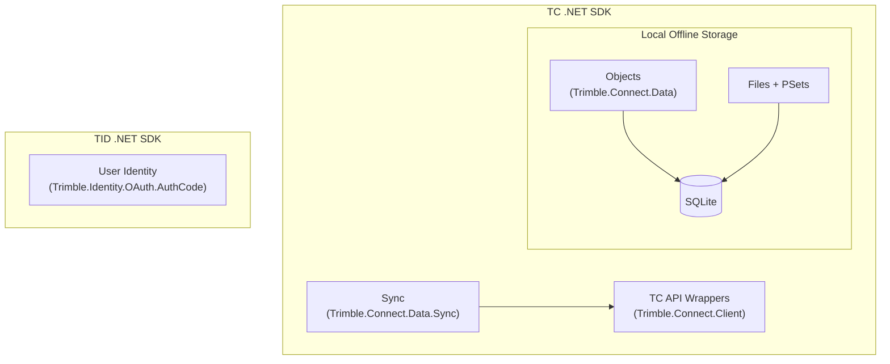
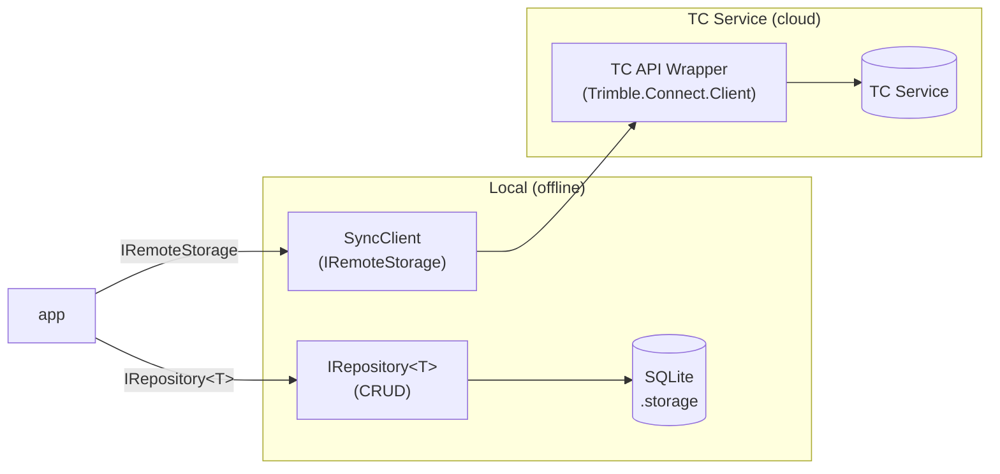
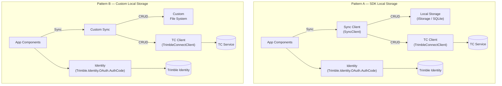

# Trimble Connect .NET SDK Developer Guide

### Content

1. [Introduction](#introduction)
2. [Components](#components)
3. [Building applications with TC SDK Components](#applications)
4. [TC environments](#environments)
5. [NuGet packages](#nuget-packages)
6. [Sample apps](#samples)
7. [Frequently asked questions](#faq)
8. [Support](#support)

### Acronyms

TID - Trimble Identity

TC - Trimble Connect

pod - TC terminology for a regional deployment of the service

### Terminology mapping

TC .NET SDK uses different terminology comparing to TC v2 REST API in some places.

<table>
  <tr>
    <td>TC REST API</td>
    <td>TC .NET SDK Data Component</td>
  </tr>
  <tr>
    <td>Alignment</td>
    <td>Placement
(Alignment class is used for the "matrix" type of the representation of the model placement)</td>
  </tr> 
</table>

## <a name="introduction">Introduction</a>

Trimble Connect .NET SDK is: 

* a set of components, tools, examples, and guidelines, 

* for desktop, web and mobile .NET application developers (both Trimble and 3rd party) as well as for service applications (e.g. server side background and interactive processes) developers,

* built to enable collaboration functionality in applications using Trimble Connect Services or implement integration of other systems with Trimble Connect.

The Trimble Connect SDK contains all of the necessary tools and building blocks to handle user authentication and to communicate with the Trimble Connect Platform Services in order to share data and collaborate with other users and applications using the TC.

The TC .NET SDK targets .NET Framework (net48), .NET Standard 2.0 (usable from .NET Core / .NET 5+), and .NET 9 mobile (Android, iOS, macOS, Mac Catalyst) via .NET MAUI. UWP is deprecated — use netstandard2.0 instead.

<!-- (Comment) Introductory presentation can be found also [TODO: insert link]().-->

API training videos are available on [youtube](https://www.youtube.com/playlist?list=PLB3LvMW41rgbYMnTAV7hchEbv9rB0G7A2).

### Why should I use TC .NET SDK

When creating .NET applications developers can choose different approaches to communicate with TC Services. They can opt to rely on the TC REST API directly and utilize built-in HttpWebRequest or HttpClient classes available in the .NET platform or use generic 3d party libraries like RestSharp (http://restsharp.org/) that help to communicate with REST services.

Using these generic network .NET APIs and libraries gives application developer full flexibility in how to communicate with the TC Services and how to organize the app code, but it might be not the most productive approach comparing to the specialized SDK. 

In addition to TC API usage the TC SDK boosts developer productivity by providing reusable ready to use functional blocks that are typically needed in real life apps. This helps building high quality applications by reusing already implemented and tested components.

The TC .NET SDK is used by the core TC applications (TCD, TCM), as well as multiple other Trimble products integrating with the TC. That proves the usability of the SDK.

All SDK components are cross platform. The same API is available on a number of target platforms. This allows to share code between mobile and desktop applications and significantly reduce the development time for a family of applications.

Below are benefits listed for each component in the TC .NET SDK.

#### Trimble.Identity.OAuth.AuthCode

The recommended interactive authentication component ([Trimble.Identity.OAuth.AuthCode](Developer%20Guide%20-%20Identity_OAuth_AuthCode.md)) implements the OAuth2 Authorization Code Grant (with optional PKCE and Serial PKCE) against Trimble Identity. It provides `AuthCodeCredentialsProvider`, which implements `ICredentialsProvider` consumed by `TrimbleConnectClient`.

#### Trimble.Connect.Client

TC API Wrappers component ([Trimble.Connect.Client](Developer%20Guide%20-%20Client.md)) can be seen as a layer on top of the generic network library. Below are some benefits of using the TC API Wrappers component in comparison to consuming the TC REST API with generic .NET libraries:

* The SDK components’ APIs are optimized to be used with specific TC Services in comparison to the generic APIs.
* Strong typing helps productivity by providing compile time error checking
* Fully built-in IntelliSense documentation support enables learning the TC API by exploring it from the IDE
* Comes with production ready components needed for the interaction with the cloud service (http message formatting and parsing, error handling, token management and caching, pods connection management) - developers can start working on features instead of building infrastructure.
* The common challenge for the connected applications is aligning the service API versioning and application versioning. The service communication code in SDK is designed and implemented with extensibility in mind and provide a set of extensibility mechanisms which help application developers to build backward and forward compatible applications.

#### Trimble.Connect.Data

One significant addition in the SDK over the direct REST API usage is the local (offline) storage component([Trimble.Connect.Data](Developer%20Guide%20-%20Data.md)) with synchronization capabilities. This component enables building occasionally connected applications. This might be a typical challenge on a construction site where good network connection might be not available. This means:

* Application's user perceived performance is not affected by network quality
* End user can continue his/her work regardless of the network or backend availability

## <a name="components">Components</a>

TC .NET SDK is provided as a set of components.

```mermaid
graph TD
    subgraph tcSDK ["TC .NET SDK"]
        Client["TC API Wrappers\n(Trimble.Connect.Client)"]
        subgraph dataLayer ["Local Offline Storage"]
            ObjStore["Objects\n(Trimble.Connect.Data)"]
            FileStore["Files + PSets"]
            SQLite[("SQLite")]
        end
        Sync["Sync\n(Trimble.Connect.Data.Sync)"]
    end

    subgraph tidSDK ["TID .NET SDK"]
        AuthCode["User Identity\n(Trimble.Identity.OAuth.AuthCode)"]
    end

    Sync --> Client
    ObjStore --> SQLite
    FileStore --> SQLite
```

TC SDK components are implemented as the following NuGet packages:

1. [Trimble.Identity.OAuth.AuthCode](Developer%20Guide%20-%20Identity_OAuth_AuthCode.md) - Interactive TID authentication (OAuth2 Authorization Code with PKCE)

2. [Trimble.Connect.Client](Developer%20Guide%20-%20Client.md) - TC API Client (TC REST API wrappers)

3. [Trimble.Connect.Data](Developer%20Guide%20-%20Data.md) and [Trimble.Connect.Data.Sync](Developer%20Guide%20-%20Data.md) - TC Data Storage (local offline storage using SQLite) with bidirectional cloud synchronization and PSet support

Packages target `net48`, `netstandard2.0`, and .NET 9 mobile platforms (Android, iOS, macOS, Mac Catalyst). PCL and UWP targets are no longer supported.

See the [NuGet packages](#nuget-packages) section for feed configuration and installation details.

## <a name="applications">Building Applications with TC SDK Components</a>

### Application design guidelines

This section shows typical application designs using the TC SDK components.

The design of offline components is based on the idea that applications (which want to work in occasionally connected mode) always use same interface to manage data regardless whether a network connection is currently available or not.

The local offline storage component exposes an `IRemoteStorage` interface which allows occasional (application driven) synchronization of local data with the TC cloud backend. Repositories expose typed `IRepository<T>` interfaces for offline CRUD operations.

```mermaid
graph LR
    App["app"]

    subgraph local ["Local (offline)"]
        Repos["IRepository&lt;T&gt;\n(CRUD)"]
        SyncAdapter["SyncClient\n(IRemoteStorage)"]
        DB[("SQLite\n.storage")]
    end

    subgraph cloud ["TC Service (cloud)"]
        Wrapper["TC API Wrapper\n(Trimble.Connect.Client)"]
        TCService[("TC Service")]
    end

    App -->|"IRepository&lt;T&gt;"| Repos
    App -->|IRemoteStorage| SyncAdapter
    Repos --> DB
    SyncAdapter --> Wrapper
    Wrapper --> TCService
```

Below are three typical app architecture examples:

1. Use SDK components for local storage and synchronizing with TC cloud backend.

2. Build an app with its own local storage. Using TC cloud backend and the custom local storage.

3. Application without local state (online only app). Using TC cloud backend without local storage.

```mermaid
graph TD
    subgraph patternA ["Pattern A — SDK Local Storage"]
        AppA["App Components"]
        SyncClientA["Sync Client\n(SyncClient)"]
        LocalStorageA["Local Storage\n(IStorage / SQLite)"]
        TCClientA["TC Client\n(TrimbleConnectClient)"]
        IdentityA["Identity\n(Trimble.Identity.OAuth.AuthCode)"]
        TCServiceA[("TC Service")]
        TIServiceA[("Trimble Identity")]

        AppA -->|Sync| SyncClientA
        SyncClientA -->|CRUD| LocalStorageA
        SyncClientA -->|CRUD| TCClientA
        AppA --> IdentityA
        TCClientA --> TCServiceA
        IdentityA --> TIServiceA
    end

    subgraph patternB ["Pattern B — Custom Local Storage"]
        AppB["App Components"]
        CustomSync["Custom Sync"]
        FileSystemB["Custom\nFile System"]
        TCClientB["TC Client\n(TrimbleConnectClient)"]
        IdentityB["Identity\n(Trimble.Identity.OAuth.AuthCode)"]
        TCServiceB[("TC Service")]
        TIServiceB[("Trimble Identity")]

        AppB -->|Sync| CustomSync
        CustomSync -->|CRUD| FileSystemB
        CustomSync -->|CRUD| TCClientB
        AppB --> IdentityB
        TCClientB --> TCServiceB
        IdentityB --> TIServiceB
    end
```

### Configuring Visual Studio

Since the TC data model uses the _ToDo_ term for one of the entity types this could conflict with “TODO:” comments that are typically used by developers and recognized by the IDE as a keyword. To avoid conflicts, the following settings are recommended in Visual Studio when using TC .NET SDK:

1. Configure ReSharper (if you are using it) to honor the case-sensitivity when searching for "TODO"

2. Add "todo" and "todos" as RecognizedWords to StyleCop settings (again, if you are using StyleCop).

## <a name="environments">TC Environments</a>

TC has several deployment environments that we encourage you to use for debugging, testing, and production.

1. Staging - this environment is recommended for integrators to use during development of connected applications:

    * Staging TC v2 API: [https://app.stage.connect.trimble.com/tc/api/2.0/](https://app.stage.connect.trimble.com/tc/api/2.0/) 

    * Staging TCW: [https://app.stage.connect.trimble.com/tc/app/](https://app.stage.connect.trimble.com/tc/app/) 

2. Production - production Trimble Connect environment

    * Production TC v2 API: [https://app.connect.trimble.com/tc/api/2.0/](https://app.connect.trimble.com/tc/api/2.0/) 

    * Production TCW: [https://connect.trimble.com/](https://connect.trimble.com/) 

The staging environment of TC uses staging environment of TID.  Production TC environment uses the production TID environment.

TID environments

* Staging TID: [https://stage.id.trimblecloud.com/](https://stage.id.trimblecloud.com/)

* Production TID: [https://id.trimble.com/](https://id.trimble.com/)

## <a name="nuget-packages">NuGet packages</a>

Packages are published to the Trimble NuGet Artifactory feed. Configure the feed in your `nuget.config` before installing. Contact [connect-integrate@trimble.com](mailto:connect-integrate@trimble.com) for feed credentials.

| Package | Purpose |
|---------|---------|
| `Trimble.Identity.OAuth.AuthCode` | Interactive TID OAuth2 (Authorization Code + PKCE) |
| `Trimble.Connect.Client` | TCPS REST API v2 wrapper |
| `Trimble.Connect.Data` | Local SQLite storage |
| `Trimble.Connect.Data.Sync` | Bidirectional cloud synchronization |

All packages support the following platforms:

* `net48` — .NET Framework (Windows desktop)
* `netstandard2.0` — .NET Core / .NET 5+ / legacy Xamarin / UWP
* `net9.0-android` — Android (via .NET MAUI)
* `net9.0-ios` — iOS (via .NET MAUI)
* `net9.0-macos` — macOS (via .NET MAUI)
* `net9.0-maccatalyst` — Mac Catalyst (via .NET MAUI)
* `net9.0-windows10.0.19041.0` — Windows (via .NET MAUI)

## <a name="samples">Sample apps</a>

Example apps can be found at the [tc-samples repository on GitHub](https://github.com/trimble-oss/tc-samples).

## <a name="faq">Frequently asked questions</a>

Please check the [FAQ](Developer%20Guide%20-%20FAQ.md) document.

## <a name="support">Support</a>

See https://developer.trimble.com/docs/connect#support-and-community.

